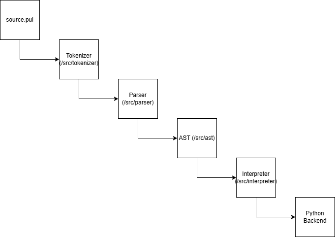

# Pulse Language — Phase 1 Report Draft

**Authors:**

- Hafiz Muhammad Ahmad
- Daud Anjum

**Phase:** 1  
**Date:** 03-Dec-2025

---

## Table of Contents

1. [Problem Statement & Scope](#problem-statement--scope)
2. [Language Specification v1](#language-specification-v1)
3. [Token List](#token-list)
4. [AST Sketch](#ast-sketch)
5. [Example Programs](#example-programs)
6. [Architecture Diagram](#architecture-diagram)
7. [Modules Plan](#modules-plan)
8. [Backend Stub Results](#backend-stub-results)

---

## Problem Statement & Scope

_(Content from `docs/problem-and-scope.md`)_

### Pulse — Problem Statement & Scope

_Date: 28-11-2025_

---

### Problem Statement

**AI and ML** development today depends on heavy, **general-purpose languages** (Python, R, MATLAB, etc.) stuffed with external libraries, complex environment setups, and tons of boilerplate code. These languages are **not AI-native** and they treat tensors, matrices, and ML operations as add-ons instead of first-class citizens.

This makes AI development **slow, complex, and unfriendly** for beginners. Debugging becomes harder, prototypes take longer, and rapid experimentation suffers. There is no lightweight, beginner-friendly AI-native programming language designed purely for ML workflows.

### Problem Solution

**Pulse** is designed to solve this gap by introducing a **minimal AI-first programming language**, built to express tensor computations, matrix algebra, and AI workflows with direct, readable syntax. It aims to provide the clarity of Python with the precision of a dedicated DSL — offering a clean interpreter built in Python that executes tensor operations via NumPy (and later, GPU frameworks). Pulse cuts away boilerplate, reduces dependency chaos, and makes AI development smoother, faster, and more accessible.

Pulse primarily benefits:

- **AI/ML students** learning how interpreters and tensor operations connect
- **Researchers** prototyping simple models or tensor math quickly
- **Educators** demonstrating the core ideas behind AI languages without heavy frameworks

---

### Project Scope

#### **In Scope (v1)**

- Tokenizer / Lexer
- Parser and Abstract Syntax Tree (AST)
- Tree-walk Interpreter in Python
- Tensor data type mapped to NumPy
- Basic mathematical and tensor operations (`+`, `-`, `*`, `@`, `reshape`, etc.)
- REPL (interactive shell) for quick experimentation
- Basic error handling and diagnostics
- Simple standard library (print, shape, zeros, ones, etc.)

#### **Out of Scope (v1)**

- JIT compilation or bytecode optimization
- GPU driver-level execution (CUDA, ROCm)
- Advanced type inference
- Package management
- Multi-threading or async execution
- Deep learning model abstraction (planned for v2)

---

### Summary

Pulse v1 focuses on **clarity, learning, and foundation** — proving that an AI-first language can be elegant, minimal, and practical. Later phases will explore **performance (JIT)**, **types**, and **GPU extensions**, but the current goal is to establish a **working interpreter prototype** that supports clean tensor computation semantics.

---

## Language Specification v1

_(Content from `docs/spec_v1.md`)_

### Pulse Language Specification v1

### 1. Keywords

```
def, return, if, elif, else, while, for, break, continue, pass, try, except, import, from, as, and, or, not, True, False, class, self, in, del, dot, transpose
```

### 2. Data Types

```
int, float, bool, string, list, tuple, set, dict, range, tensor, matrix
```

> Tensor and Matrix are AI-native types; the rest are standard.

### 3. Operators & Precedence

| Operator          | Description                   | Precedence |
| ----------------- | ----------------------------- | ---------- |
| `()`              | Grouping                      | 1          |
| `[]`              | Indexing / slicing            | 1          |
| `+` `-` (unary)   | Unary plus / minus            | 2          |
| `*` `/` `%`       | Multiplication, Division, Mod | 3          |
| `+` `-` (binary)  | Addition, Subtraction         | 4          |
| `dot`             | Dot product (tensor)          | 5          |
| `transpose`       | Transpose (matrix/tensor)     | 6          |
| `==` `!=`         | Equality / inequality         | 7          |
| `<` `>` `<=` `>=` | Comparison                    | 7          |
| `and` `or` `not`  | Logical operators             | 8          |

### 4. Core Grammar Rules (pseudo-BNF)

```
<program>       ::= { <statement> }

<statement>     ::= <assignment> | <if_stmt> | <while_stmt> | <for_stmt> | <func_def> | <expr_stmt>

<assignment>    ::= IDENTIFIER "=" <expression>

<if_stmt>       ::= "if" <expression> ":" <block> [ "elif" <expression> ":" <block> ]*
[ "else" ":" <block> ]

<func_def>      ::= "def" IDENTIFIER "(" [IDENTIFIER {"," IDENTIFIER}* ] ")" ":" <block>

<expression>    ::= <term> { ("+" | "-") <term> }*

<term>          ::= <factor> { ("*" | "/" | "dot") <factor> }*

<factor>        ::= NUMBER | STRING | BOOL | IDENTIFIER | "tensor" "(" <expression_list> ")
" | "matrix" "(" <expression_list> ")" | "(" <expression> ")"
```

### 5. Example Snippets

```pul
# Variable assignment
X = tensor([1, 2, 3])

# Function
def square(a):
    return a * a

# If/Else
if x[0] > 0:
    print("positive")
else:
    print("negative")

# For loop
for i in range(0, 5):
    print(i)

# While loop
while x[0] < 10:
    x = x + 1
```

---

## Token List

_(Content from `docs/tokens.md`)_

### Pulse Language — Token Types

This document defines all token categories used by the Pulse lexer. Tokens are grouped for clarity (keywords, literals, operators, punctuation, structural tokens).

### 1. Identifiers

| Token      | Description                                              |
| ---------- | -------------------------------------------------------- |
| IDENTIFIER | Variable names, function names, user-defined identifiers |

Rules:

- Start with letter or \_
- Followed by letters, digits, \_
- Examples: `x`, `_hidden`, `myTensor3`

### 2. Literals

| Token          | Description                                       |
| -------------- | ------------------------------------------------- |
| NUMBER         | Integer or float numeric literal                  |
| STRING         | `"hello"` style string                            |
| BOOL           | `True` or `False`                                 |
| TENSOR_LITERAL | Tensor literal, e.g. `[1, 2, 3]`, `[[1,2],[3,4]]` |

### 3. Keywords

Pulse Keywords:

`def`, `return`, `if`, `elif`, `else`, `while`, `for`, `break`, `continue`, `pass`, `try`, `except`, `import`, `from`, `as`, `and`, `or`, `not`, `True`, `False`, `class`, `self`, `in`, `del`, `dot`, `transpose`

### 4. Operators

#### Arithmetic

`+ - * / %`

#### Tensor / Linear Algebra

`dot` `transpose`

#### Assignment

`= += -= \*= /=`

#### Comparison

`== != < > <= >=`

#### Logical

`and` `or` `not`

### 5. Punctuation & Delimiters

`( )  [ ]  { }  ,  :  ;`

### 6. Structural Tokens

Indentation-based (Python-style)

`INDENT`
`DEDENT`
`NEWLINE`

### 7. Comment Tokens

`COMMENT` - Lines starting with `#` are treated as comments and ignored by the lexer.

### 8. Special Tokens

`EOF` - End of file  
`ERROR` - Invalid or unrecognized token

---

## Ast Sketch

_(Content from `docs/ast.md`)_

### Pulse Language — AST Node Types

This document defines the Abstract Syntax Tree (AST) node classes for Pulse. Each node represents a syntactic construct in the language. These nodes will be used by the parser and evaluator.

### 1. Expression Nodes

| Node Name     | Description                                   | Fields / Children                           |
| ------------- | --------------------------------------------- | ------------------------------------------- |
| BinaryExpr    | Binary operation (a + b, a \* b, a dot b)     | left (Expr), operator (Token), right (Expr) |
| UnaryExpr     | Unary operation (-a, not a)                   | operator (Token), operand (Expr)            |
| LiteralExpr   | Literal values (number, string, bool, tensor) | value                                       |
| VariableExpr  | Variable reference                            | name (Token)                                |
| AssignExpr    | Variable assignment                           | name (Token), value (Expr)                  |
| CallExpr      | Function or method call                       | callee (Expr), arguments (list of Expr)     |
| GetAttrExpr   | Access attribute (obj.attr)                   | object (Expr), name (Token)                 |
| SetAttrExpr   | Set attribute (obj.attr = val)                | object (Expr), name (Token), value (Expr)   |
| TensorLiteral | Tensor creation literal                       | values (list of Expr or nested lists)       |
| MatrixLiteral | Matrix creation literal                       | values (list of lists of Expr)              |

### 2. Statement Nodes

| Node Name     | Description                | Fields / Children                                                   |
| ------------- | -------------------------- | ------------------------------------------------------------------- |
| ExprStmt      | Expression as a statement  | expression (Expr)                                                   |
| PrintStmt     | Print statement            | expression (Expr)                                                   |
| VarDeclStmt   | Variable declaration       | name (Token), initializer (Expr)                                    |
| BlockStmt     | Block of statements        | statements (list of Stmt)                                           |
| IfStmt        | Conditional if/elif/else   | condition (Expr), then_branch (Stmt), else_branch (Stmt)            |
| WhileStmt     | While loop                 | condition (Expr), body (Stmt)                                       |
| ForStmt       | For loop                   | initializer (Stmt), condition (Expr), increment (Expr), body (Stmt) |
| FuncDeclStmt  | Function declaration       | name (Token), params (list of Token), body (BlockStmt)              |
| ReturnStmt    | Return statement           | value (Expr)                                                        |
| ClassDeclStmt | Class declaration          | name (Token), methods (list of FuncDeclStmt)                        |
| TryStmt       | Exception handling         | try_block (BlockStmt), except_block (BlockStmt)                     |
| BreakStmt     | Break statement in loop    | –                                                                   |
| ContinueStmt  | Continue statement in loop | –                                                                   |
| PassStmt      | Pass (no-op)               | –                                                                   |

### 3. Notes

- Expressions are usually evaluated to produce values; statements control program flow.
- AST nodes will be instantiated by the parser during parsing and later used by the interpreter.
- Tensor and matrix literals are treated as specialized literal expressions for AI-specific operations.
- This AST structure is minimal but sufficient for starting the interpreter.

---

## Example Programs

_(Content from `docs/examples.md`)_

### Pulse Example Programs

This document lists example programs written in Pulse pseudo-code.  
These examples demonstrate the core syntax, language constructs, and AI-specific operations of Pulse.  
Each file is self-contained and includes a one-line description of expected behavior.

### Examples

| File                       | Description                                           |
| -------------------------- | ----------------------------------------------------- |
| 01_variables.pul           | Variable assignment and basic arithmetic              |
| 02_arithmetic.pul          | Demonstrates arithmetic operations (+, -, \*, /)      |
| 03_print.pul               | Console output using print()                          |
| 04_functions.pul           | Defining and calling simple functions                 |
| 05_if_else.pul             | Basic if/else conditional statements                  |
| 06_if_elif_else.pul        | Multi-branch if/elif/else statements                  |
| 07_while_loop.pul          | while loop demonstration                              |
| 08_for_loop.pul            | for loop demonstration                                |
| 09_tensor_creation.pul     | Creating tensors and initializing values              |
| 10_tensor_operations.pul   | Basic tensor operations (add, multiply, element-wise) |
| 11_dot_product.pul         | Dot product between tensors example                   |
| 12_matrix_creation.pul     | Creating matrices via matrix() wrapper                |
| 13_matrix_mul.pul          | Basic matrix multiplication and operations            |
| 14_simple_model_train.pul  | Defining a simple class and training method           |
| 15_model_predict.pul       | Using class methods to make predictions               |
| 16_nested_if.pul           | Nested if statements example                          |
| 17_chained_operations.pul  | Chained arithmetic and tensor operations              |
| 18_tensor_indexing.pul     | Indexing into tensors and accessing elements          |
| 19_tensor_slice.pul        | Slicing tensors for subarrays                         |
| 20_tensor_reshape.pul      | Reshaping tensors to different dimensions             |
| 21_model_eval.pul          | Evaluating models and running predictions             |
| 22_break_continue_pass.pul | Loop control: break, continue, and pass statements    |
| 23_recursion.pul           | Recursive function examples                           |
| 24_class_basic.pul         | Defining basic classes with attributes and methods    |
| 25_class_inheritance.pul   | Class inheritance and method overriding               |
| 26_console_io.pul          | Console input and output demonstration                |
| 27_file_io.pul             | File reading and writing example                      |
| 28_exception_handling.pul  | Handling exceptions using try/except blocks           |

### Usage

To run an example, execute the Pulse interpreter with the file:

```bash
$ pulse examples/01_variables.pul
```

### Notes

- All examples follow Pythonic syntax for readability.
- Tensor and matrix operations demonstrate AI-specific language constructs.
- Some examples include expected output in comments at the top of the file.

---

## Architecture Diagram



---

## Modules Plan

_(Content from `docs/modules.md`)_

### Pulse Architecture — Module Responsibilities (Phase 2)

This document defines all modules that will be implemented in Phase 2 of Pulse v1. Each module has a clear responsibility and maps directly to the interpreter architecture.

### 1. `tokenizer/`

Files:  
`tokenizer.py`  
`tokens.py`

Responsibilities:

- Convert raw `.pul` source code into a stream of tokens.
- Handle identifiers, numbers, strings, operators, punctuation, whitespace, comments, and EOF.
- Provide consistent error reporting for illegal characters.
- Output: list of Token objects.

### 2. `parser/`

Files:  
`parser.py`  
`grammar.md` (optional reference)

Responsibilities:

- Read tokens and produce an Abstract Syntax Tree (AST).
- Implement recursive-descent parsing using the grammar from `spec_v1.md`.
- Detect and report syntax errors.
- AST types produced: expressions, statements, declarations.

### 3. `ast/`

Files:  
`ast.py`  
`visitor.py` (optional)

Responsibilities:

- Define AST node classes (BinaryExpr, UnaryExpr, CallExpr, Literal, VarDecl, IfStmt, WhileStmt, ForStmt, FuncDecl, ClassDecl, etc.).
- Define base Visitor interface if using the visitor pattern.
- Provide a clean, typed tree representation for the interpreter.

### 4. `interpreter/`

Files:  
`interpreter.py`  
`environment.py`  
`builtins.py`

Responsibilities:

- Walk the AST and execute program behavior.
- Implement evaluation rules for expressions and statements.
- Manage variable scopes and lexical environments.
- Execute built-in functions (print, tensor(), matrix(), length(), etc.).
- Handle runtime errors.

### 5. `backend/`

Files:  
`python_backend.py`

Responsibilities:

- Provide Python-side implementation for: tensors (NumPy arrays), matrix ops, dot product, reshape, broadcasting.
- Pulse interpreter calls these when AI/tensor features appear in code.

### 6. `repl/`

Files:  
`repl.py`

Responsibilities:

- Provide an interactive REPL for Pulse.
- Accept input, tokenize → parse → interpret line-by-line.
- Support multiline blocks (if, while, function, etc.).

### 7. `errors/`

Files:  
`lexer_error.py`  
`parser_error.py`  
`runtime_error.py`

Responsibilities:

- Centralized and consistent error formatting.
- Pretty printed errors with line number + snippet.
- Stop interpretation cleanly on fatal errors.

### 8. `tests/`

Files:  
`tokenizer.md`  
`parser.md`  
`interpreter.md`

Responsibilities:

- Manual and automated tests for each phase.
- Example .pul programs converted into expected outputs.

### 9. `pulse.py`

Responsibilities:

- Main entrypoint that:
  - accepts a .pul file
  - runs tokenizer → parser → interpreter pipeline
  - enforces ".pul only" rule

### Summary

This module plan ensures that:

- Each module has one job.
- No circular garbage.
- The interpreter stays clean, readable, and expandable for AI features later.

---

## Backend Stub Results

_(Content from `tests/backend_test.md`)_

### Backend Tests — Phase 1 Step 8

### Test 1: tensor_from_list

Input: [1, 2, 3]  
Output:
[1 2 3]

### Test 2: dot

Input: [1, 2] ⋅ [3, 4]  
Output: 11

### Test 3: tensor_add

Input: [1, 2] + [3, 4]  
Output: [4 6]

### Test 4: shape

Input: [[1,2,3], [4,5,6]]  
Output: (2, 3)

---
